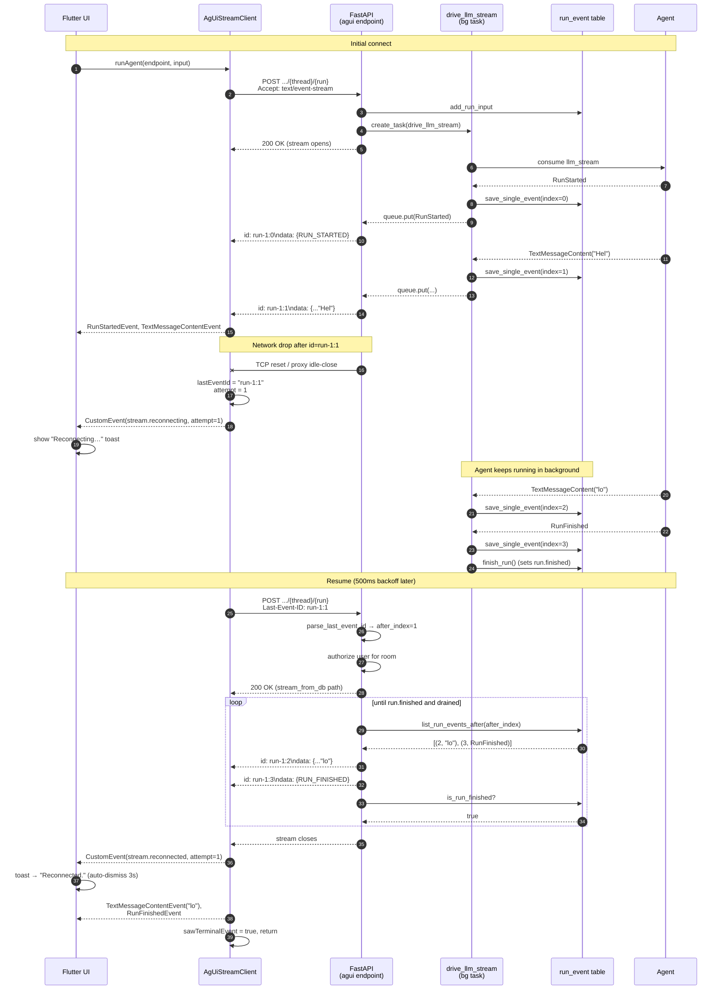

# SSE Stream Resume

How Soliplex uses the AG-UI protocol and the `run_event` message store
to let clients transparently reconnect to an in-flight run after a
dropped network connection.

## Why this exists

AG-UI runs are long-lived, token-by-token SSE streams. A mobile radio
flap, a proxy idle-timeout, or a sleeping laptop can tear the
connection down mid-response. Without resume, the user sees a partial
message and the run appears broken even though the agent is still
running on the server. With resume, the agent keeps running, the
client reconnects with a `Last-Event-ID`, and the UI catches up to the
current state as if nothing happened.

The mechanism is the browser-standard SSE resume primitive
([WHATWG spec](https://html.spec.whatwg.org/multipage/server-sent-events.html#the-last-event-id-header))
plus a persistent copy of every streamed event so the server can
replay from an arbitrary point.

## Architecture

Three layers collaborate:

1. **Protocol layer** — every `data:` frame on the wire carries an
   `id:` prefix of the form `{run_id}:{event_index}`. The client
   echoes the most recently seen id back on reconnect via the
   `Last-Event-ID` HTTP header.
2. **Storage layer** — every event the agent emits is written to the
   `run_event` table (ordered by its autoincrement primary key)
   before being flushed to the live SSE stream. A separate `finished`
   timestamp on the `run` row tells reconnecting consumers when
   polling can stop.
3. **Client layer** — the Flutter `AgUiStreamClient` tracks the last
   seen id, detects stream drops, reconnects with `Last-Event-ID`,
   and emits lifecycle `CustomEvent`s (`stream.reconnecting`,
   `stream.reconnected`, `stream.reconnect_failed`) so the UI can
   show a toast.

## Event identifier format

```text
id: {run_id}:{event_index}
data: {<json-encoded AG-UI event>}
```

- `run_id` is the UUID of the `Run` row — identifies which stream
  this event belongs to when multiple runs overlap in the same
  thread.
- `event_index` is a monotonically-increasing integer starting at 0,
  scoped to a single run. It is **not** a global sequence number;
  each run has its own. It is not stored as its own column — it is
  the position of the event within its run's `events` list, whose
  ordering is guaranteed by the autoincrement `id_` primary key on
  `run_event`.
- Keepalive comments (`: keepalive …`) and any non-`data:` frames
  pass through without an `id:` prefix — they do not consume an
  index and cannot be resumed against.

`add_sse_event_ids()` in
[src/soliplex/views/streaming.py](../src/soliplex/views/streaming.py)
is the only place ids are written; on reconnect it is re-entered with
`start_index = after_index + 1` so the replayed stream picks up
exactly where the client left off.

## Server side

### Normal first-connect path

`POST /v1/rooms/{room_id}/agui/{thread_id}/{run_id}` (no
`Last-Event-ID`) — see
[src/soliplex/views/agui.py](../src/soliplex/views/agui.py):

1. Authorize the user for the room.
2. Persist the `RunAgentInput` via `add_run_input()`.
3. Spawn a **background task** `drive_llm_stream()` that consumes
   the agent's event stream and:
   - pushes each event onto an unbounded `asyncio.Queue` (for the
     live SSE consumer), **and**
   - writes each event to `run_event` with its monotonic
     `event_index` via `save_single_event()`.
4. When the agent completes (or errors), `drive_llm_stream()` puts
   a sentinel on the queue and calls `finish_run()` which stamps
   `run.finished` with the current time.
5. The HTTP response streams events drained from the queue, encoded
   by the AG-UI adapter, tagged with ids by `add_sse_event_ids()`,
   wrapped with keepalives, and returned as a `StreamingResponse`.

**Critical decoupling:** `drive_llm_stream()` is a `create_task()`
coroutine, not awaited inline. The queue is **unbounded**. Together
this means a client disconnect cancels only the SSE response — the
background task keeps draining the agent, persisting events, and
marking the run finished. A reconnecting client can then pick up
the full tail, including events written after it disconnected.

### Reconnect path

When the request carries a `Last-Event-ID: {run_id}:{N}` header,
[`post_room_agui_thread_id_run_id`](../src/soliplex/views/agui.py)
takes a completely different path:

1. `parse_last_event_id()` splits on the final `:` and extracts
   `after_index = N`. Malformed values are treated as if the header
   was absent (i.e. a fresh run is attempted).
2. Authorize the user for the room (same check as first-connect).
3. Skip `add_run_input`, skip the agent, skip `drive_llm_stream` —
   the run is already executing (or finished) somewhere else.
4. Create a `stream_from_db()` generator scoped to
   `(user_name, room_id, thread_id, run_id, after_index=N)`.
5. Feed that generator through the normal AG-UI encoder and
   `add_sse_event_ids(start_index=N+1)` pipeline.
6. Return the same `StreamingResponse` shape as first-connect; the
   client cannot tell the difference on the wire.

`stream_from_db()` loops: call `list_run_events_after(after_index)`
(which loads `run.events` and returns the slice past
`after_index`, paired with each row's position), yield everything
it returns, update `after_index` to the last yielded index, then
check `is_run_finished()`. If not finished, sleep
`SSE_RECONNECT_POLL_INTERVAL_SECS` (0.2 s) and loop. If finished,
do one final drain query (to catch events written between the
last poll and the `finished` flag being set) and terminate.

### Storage model

```text
run                       run_event
─────────                 ─────────
id_ (PK)           <──┐   id_ (PK, autoincrement) ← ordering key
user_name             └── run_id_ (FK → run.id_, ON DELETE CASCADE)
room_id                   data                    ← json-dumped AG-UI Event
thread_id_                created
...
finished (nullable)
```

See `Run` and `RunEvent` in
[src/soliplex/agui/schema.py](../src/soliplex/agui/schema.py). Notes:

- Retention is **indefinite** — no TTL. Events live until the
  parent `run` or `thread` row is deleted (both cascade).
- `event_index` is not persisted; it is the position of the row
  within `run.events` (loaded in `id_` order). On the write side,
  `drive_llm_stream()` keeps a local counter only for log/wire
  purposes. On the read side, `list_run_events_after()` slices
  `run.events` from `after_index + 1` and pairs each row with its
  position.
- `run.finished` is the single source of truth for "no more events
  coming". Crash-recovery after a process restart relies on it
  being unset — those runs are effectively stuck (stale events in
  `run_event`, no background task running) and will poll forever
  unless cleaned up administratively.
- Events are persisted **before** they are counted as delivered —
  if the DB write fails, the error is logged but the event is
  still pushed to the live queue. The client sees it; a reconnect
  would not. This is a tradeoff in favor of live responsiveness.

## Client side

The Flutter client is in
[frontend/packages/soliplex_client/lib/src/http/agui_stream_client.dart](../../frontend/packages/soliplex_client/lib/src/http/agui_stream_client.dart).

### Tracking the last seen id

`AgUiStreamClient.runAgent()` parses SSE via the `ag_ui` package's
`SseParser`, which exposes `SseMessage.id` for every dispatched
message. The client holds a local `String? lastEventId` and updates
it on each non-empty id. The `SseParser` preserves `_lastEventId`
across messages per the spec — individual `data:` frames do not
need to repeat their own id.

### When to resume

Resume is triggered **only by stream errors**, not by clean EOF:

| Termination condition | Client action |
|---|---|
| Normal close after `RUN_FINISHED`/`RUN_ERROR` | Done, return. |
| Clean EOF without a terminal event | Done, return (log only). |
| `CancelledException` (user cancel) | Propagate, never resume. |
| Initial-connect `AuthException` (401/403) | Propagate. |
| Initial-connect `NetworkException` | Propagate (no id to resume against). |
| Stream error mid-body, `lastEventId != null` | **Resume.** |
| `NetworkException` on reconnect attempt | Retry, counts toward budget. |
| 5xx `ApiException` on reconnect attempt | Retry, counts toward budget. |
| 4xx `ApiException` / `AuthException` on reconnect | Synthesize terminal failure, stop. |

A resume attempt reissues the same `POST` to the same URL with
the same body — **plus** a `Last-Event-ID` header. The server
routes it to `stream_from_db`. The client does not know, and does
not need to know, whether the agent is still running or has
already finished.

### Retry policy

Configured by `ResumePolicy` (defaults):

- 5 attempts per drop, 500 ms → 8 s exponential backoff (×2), ±20 %
  jitter.
- Attempt counter **resets to zero** after a successful resume — the
  budget is per-drop, not cumulative over the lifetime of the run.
- On exhaustion, the client yields a
  `CustomEvent(name: 'stream.reconnect_failed', …)` followed by a
  synthetic `RunErrorEvent(code: 'stream.resume_failed')`, then
  returns cleanly. Downstream state machines see a terminal run via
  the normal `RunErrorEvent` path — no resume-specific branches
  needed in the UI state layer.

### Surfacing the lifecycle to the UI

The client emits three synthetic `CustomEvent`s interleaved with
the real run events:

| `name`                    | `value`                                 |
|---------------------------|-----------------------------------------|
| `stream.reconnecting`     | `{attempt, lastEventId, error}`         |
| `stream.reconnected`      | `{attempt}`                             |
| `stream.reconnect_failed` | `{attempts, error}`                     |

These are **never** sent by the server and **never** written to the
`run_event` table — they exist only within a single client run
instance. `ReconnectStatus.tryParse()` parses them into a typed
sealed class; `AgentSession` exposes a `reconnectStatus` signal
that drives the `_ReconnectBanner` toast above the chat thread.

### Logging

All client-side resume activity logs under the
`soliplex_client.agui_stream` logger name:

- Level 800 (info): attempt start and success.
- Level 900 (warning): stream drop detected, will attempt resume.
- Level 1000 (severe): final give-up after exhausted attempts.

Server-side activity is captured by `logfire` spans around
`drive_llm_stream()` and the endpoint handler; reconnects surface
as additional entries under the same endpoint span.

## Sequence diagram

Example: a run that starts normally, is interrupted mid-stream by a
network drop, and resumes via `Last-Event-ID`.



## File reference

### Backend

| Concern | File | Symbols |
|---|---|---|
| Endpoint dispatch & Last-Event-ID parse | [src/soliplex/views/agui.py](../src/soliplex/views/agui.py) | `parse_last_event_id`, `post_room_agui_thread_id_run_id` |
| Background event pump + DB writes | [src/soliplex/views/agui.py](../src/soliplex/views/agui.py) | `drive_llm_stream`, `save_single_event`, `finish_run` |
| SSE id injection & DB replay | [src/soliplex/views/streaming.py](../src/soliplex/views/streaming.py) | `add_sse_event_ids`, `stream_from_db` |
| Event persistence API | [src/soliplex/agui/persistence.py](../src/soliplex/agui/persistence.py) | `ThreadStorage.save_single_event`, `list_run_events_after`, `is_run_finished`, `finish_run` |
| Storage schema | [src/soliplex/agui/schema.py](../src/soliplex/agui/schema.py) | `Run`, `RunEvent` |
| Unit tests | tests/unit/views/test_agui_views.py | `test_post_room_agui_reconnect` |
| End-to-end tests | tests/functional/test_agui_thread.py | `test_sse_resume_with_last_event_id` |

### Frontend

| Concern | File | Symbols |
|---|---|---|
| SSE client + resume loop | frontend/packages/soliplex_client/lib/src/http/agui_stream_client.dart | `AgUiStreamClient.runAgent` |
| Retry config + typed status | frontend/packages/soliplex_client/lib/src/http/resume_policy.dart | `ResumePolicy`, `ReconnectEvent`, `ReconnectStatus` |
| Session bridging | frontend/packages/soliplex_agent/lib/src/runtime/agent_session.dart | `AgentSession.reconnectStatus` |
| Thread view state | frontend/lib/src/modules/room/thread_view_state.dart | `ThreadViewState.reconnectStatus` |
| Toast widget | frontend/lib/src/modules/room/ui/room_screen.dart | `_ReconnectBanner` |

## Design notes and limits

- **Per-run, not per-thread.** `Last-Event-ID` scopes to one run.
  Once a run ends, a new user turn creates a new run with a fresh
  `event_index` counter — a client's `lastEventId` from the
  previous run is not meaningful for the new one.
- **Authorization is re-checked on every reconnect.** Revoked
  permissions mid-run terminate the resume cleanly (4xx →
  synthetic terminal event on the client).
- **Event persistence is best-effort.** DB write failures during
  `drive_llm_stream` are logged but do not stop live delivery —
  the cost is that those specific events cannot be replayed. A
  reconnect after such a failure will skip them.
- **Polling cost.** Reconnect readers poll every 200 ms. For
  long-lived resumes against a slow agent, this is cheap
  (indexed query on `event_index`) but non-zero; an event-driven
  notification would be more efficient at the cost of added
  complexity.
- **Crash recovery is partial.** A server crash mid-run leaves
  `run.finished` unset. A reconnecting client will poll forever
  (modulo its own retry budget). There is no watchdog that
  force-finishes orphaned runs.
- **Synthetic client events never round-trip.** `stream.*`
  `CustomEvent`s are constructed in-memory by the Dart client;
  the server neither emits nor persists them, so they will not
  appear in a replay after a second drop.
