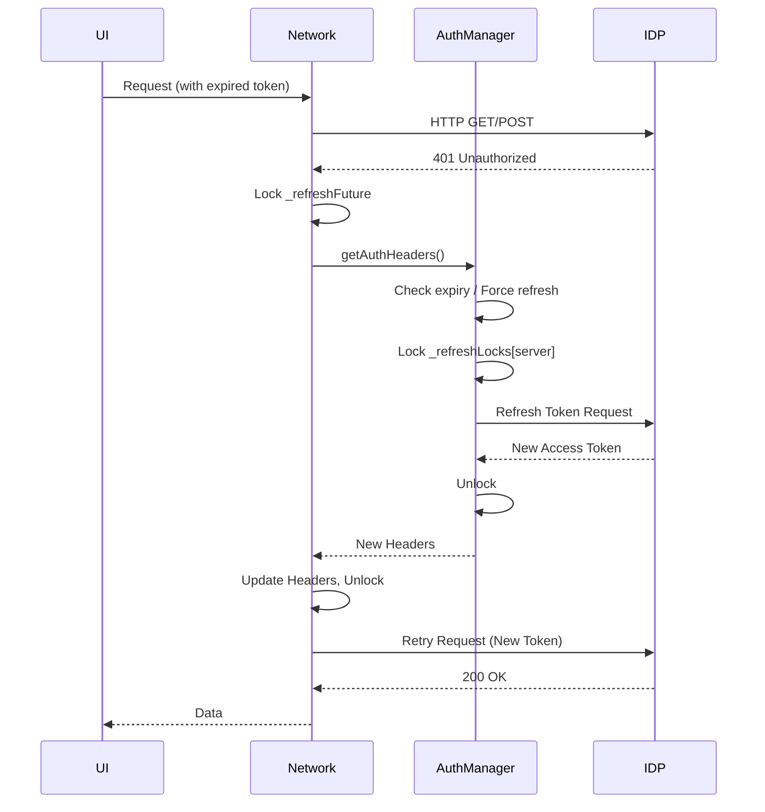

# OIDC Bearer Token Refresh Specification

**Status:** Draft
**Owner:** @runyaga
**Created:** 2025-12-14

## Context

The application interacts with secured backend endpoints using OIDC Bearer tokens. These tokens have a finite lifespan. To ensure a seamless user experience, the application must handle token expiration gracefully by refreshing the token using the refresh token, without forcing the user to re-authenticate.

The core "plumbing" for this architecture is already in place:
- **`NetworkTransportLayer`**: Handles HTTP/SSE requests and has a hook for 401 retries.
- **`ConnectionManager`**: Bridges the network layer with the auth system via `HeaderRefresher`.
- **`AuthManager`**: Manages token storage and refresh logic.
- **`OidcAuthInteractor`**: Abstraction for platform-specific OIDC operations (Web/Mobile).

## Goals

1.  **Proactive Refresh**: Refresh tokens automatically before they expire (e.g., 5 minutes buffer) to avoid 401s.
2.  **Reactive Refresh**: Intercept 401 Unauthorized responses, refresh the token, and retry the request transparently.
3.  **Concurrency Handling**: Prevent "thundering herd" issues where multiple concurrent requests triggering 401s cause multiple refresh calls. Only one refresh should occur, and other requests should wait.
4.  **Platform Support**: Support both Mobile (flutter_appauth) and Web (manual HTTP refresh) flows.
5.  **Robustness**: Handle refresh failures gracefully (prompt for re-login, do not loop).

## Non-Goals

-   Changing the OIDC provider configuration dynamically (out of scope).
-   Implementing custom OAuth flows beyond standard Code + PKCE.

## Design

### Architecture

The implementation relies on a layered approach:

1.  **Transport Layer (`NetworkTransportLayer`)**:
    -   Monitors all `http.Client` and `AgUiClient` (SSE) requests.
    -   On `401 Unauthorized`:
        -   Acquires a local lock (`_refreshFuture`).
        -   Calls the injected `headerRefresher`.
        -   Updates its internal headers with the result.
        -   Retries the request **once**.

2.  **Service Layer (`AuthManager`)**:
    -   **Proactive**: `getAccessToken` checks `expiresAt`. If within buffer (5 mins), triggers `_tryRefreshToken`.
    -   **Reactive**: `getAuthHeaders` calls `getAccessToken`.
    -   **Locking**: `_tryRefreshToken` uses `_refreshLocks` (mapped by server ID) to ensure only one actual network call to the IDP happens per server.

3.  **Interactor (`OidcAuthInteractor`)**:
    -   `OidcMobileAuthInteractor`: Uses `FlutterAppAuth.token` with `refreshToken`.
    -   `OidcWebAuthInteractor`: Sends direct `POST` to token endpoint.

### Data Flow

## Plan

### Phase 1: Verification & Hardening (Current)

The implementation exists but needs rigorous verification.

1.  **Audit `NetworkTransportLayer`**: Ensure `_handle401` correctly handles SSE streams (which are tricky to retry).
    *   *Note:* Current implementation supports `streamPost` retry but `runAgent` (SSE) retry logic might restart the stream from scratch. Verify this behavior is acceptable.
2.  **Audit `AuthManager`**: Verify `_tryRefreshToken` correctly handles errors (e.g., refresh token expired/revoked) by returning `false` so the app can redirect to login.
3.  **Unit Tests**: Add tests for concurrency (multiple 401s).

### Phase 2: Tests

1.  Create `test/core/network/token_refresh_test.dart`.
2.  Mock `http.Client` to simulate 401s.
3.  Verify single refresh call for multiple requests.
4.  Verify retry with new token.

## Implementation Status

- [x] `NetworkTransportLayer` 401 handling.
- [x] `AuthManager` refresh logic and locking.
- [x] `OidcWebAuthInteractor` refresh.
- [x] `OidcMobileAuthInteractor` refresh.
- [ ] Comprehensive Concurrency Tests.
